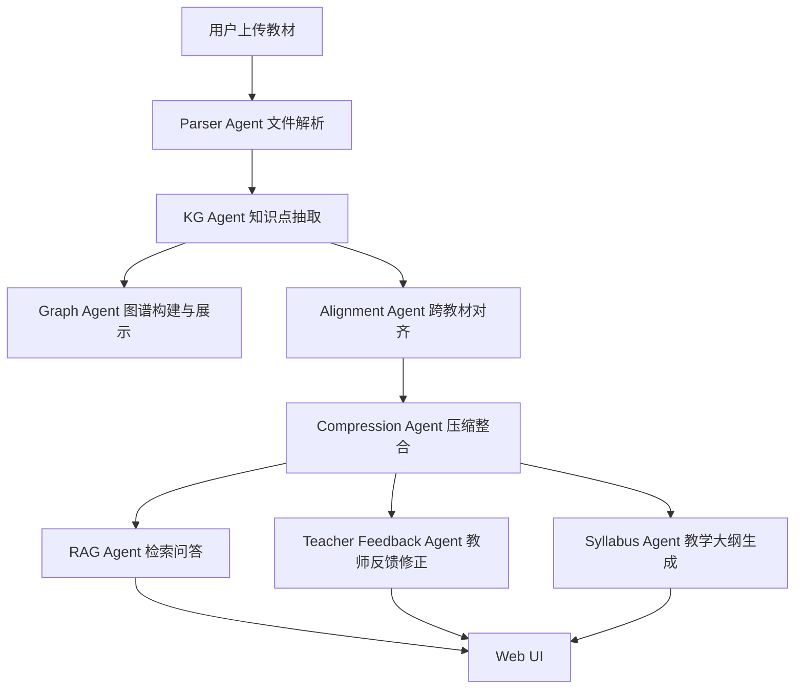

# Agent 架构说明

## 1. 架构总览

本项目采用「模块化单体应用 + Agent 化职责划分」的设计。在 5 小时黑客松场景下，直接使用复杂多 Agent 框架会增加部署和调试风险。因此 MVP 阶段采用 Streamlit 单体 Web 应用，但在逻辑上拆分为多个 Agent/模块，保证职责清晰、后续可替换为 LangGraph 等框架。



## 2. 模块职责

| Agent | 职责 | 核心输入 | 核心输出 |
|-------|------|----------|----------|
| Parser Agent | PDF/Markdown/TXT/Word/Excel 解析 | 上传文件 | 统一章节结构 |
| KG Agent | 调用 LLM 抽取知识点 | 章节内容 | nodes + edges |
| Alignment Agent | 跨教材语义对齐 | 多本教材图谱 | merge/keep/supplement 决策 |
| Compression Agent | 30% 精华版压缩 | 对齐结果 + 反馈 | 精华版大纲 |
| RAG Agent | 混合检索问答 | 问题 + 教材 | 带引用的答案 |
| Teacher Feedback Agent | 自然语言反馈处理 | 教师反馈 | 更新决策 |
| Syllabus Agent | 自动生成教学大纲 | 精华版 | 教学大纲文档 |

## 3. 设计决策论证

### 3.1 为什么选择单体应用而非多 Agent 框架？

**考量因素**：

| 因素 | 单体+模块化 | LangGraph 多 Agent |
|------|-------------|-------------------|
| 开发速度 | ⭐⭐⭐⭐⭐ 5 小时可完成 | ⭐⭐ 需额外学习成本 |
| 部署复杂度 | ⭐⭐⭐⭐⭐ 一个命令 | ⭐⭐ 需配置状态管理 |
| Token 效率 | ⭐⭐⭐⭐⭐ 内部调用 | ⭐⭐ 通信开销大 |
| 可调试性 | ⭐⭐⭐⭐⭐ 直接断点 | ⭐⭐ 状态流复杂 |

**结论**：MVP 阶段优先保证功能完整性，选择单体架构。

### 3.2 为什么使用 Streamlit 而非 FastAPI + React？

| 考量 | Streamlit | FastAPI + React |
|------|-----------|-----------------|
| 开发效率 | 5-10x 提升 | 需分别开发前后端 |
| 赛题要求 | Web 应用即可 | 非强制要求 |
| 资源占用 | 轻量，CPU 友好 | 需更多资源 |
| 图表集成 | 原生支持 pyvis/ECharts | 需额外配置 |

**结论**：Streamlit 满足赛题「Web 应用」要求，且开发效率最高。

### 3.3 为什么引入 BM25 + Embedding 混合检索？

**单一检索的局限性**：

| 检索方式 | 优势 | 劣势 |
|----------|------|------|
| 纯 BM25 | 精确术语匹配好 | 语义泛化能力弱 |
| 纯 Embedding | 语义相似度高 | 专有名词召回差 |

**混合检索策略**（RRF 融合）：

```python
# Reciprocal Rank Fusion
def rrf_fusion(results_list: list[list], k: int = 60) -> list:
    scores = defaultdict(float)
    for results in results_list:
        for rank, item in enumerate(results):
            scores[item] += 1 / (k + rank + 1)
    return sorted(scores.items(), key=lambda x: x[1], reverse=True)
```

**效果**：同时覆盖精确匹配和语义相似场景。

### 3.4 为什么使用 sentence-transformers 而非 OpenAI Embedding？

| 考量 | sentence-transformers | OpenAI Embedding |
|------|----------------------|-----------------|
| 成本 | 免费，本地运行 | API 费用 |
| 延迟 | 本地推理更快 | 网络请求 |
| 多语言 | paraphrase-multilingual 模型中文效果好 | 需选择 ada-002 |
| 隐私 | 数据不离本地 | 需上传文本 |

**结论**：教育场景数据敏感，本地 embedding 更安全。

## 4. 数据流设计

```
┌─────────────────────────────────────────────────────────────────┐
│                        用户交互层 (Streamlit)                      │
└─────────────────────────────────────────────────────────────────┘
                                    │
                                    ▼
┌─────────────────────────────────────────────────────────────────┐
│                     Agent 协调层 (Session State)                   │
│  textbooks[] | integration_plan[] | feedback[] | essence_outline  │
└─────────────────────────────────────────────────────────────────┘
         │                    │                    │
         ▼                    ▼                    ▼
┌─────────────────┐  ┌─────────────────┐  ┌─────────────────┐
│  Parser Agent   │  │   KG Agent      │  │  RAG Agent      │
│  - PDF 解析      │  │  - LLM 抽取     │  │  - Hybrid Search│
│  - 章节识别      │  │  - 关系抽取     │  │  - Answer Gen   │
└─────────────────┘  └─────────────────┘  └─────────────────┘
         │                    │                    │
         └────────────────────┼────────────────────┘
                               ▼
┌─────────────────────────────────────────────────────────────────┐
│                        知识整合层                                │
│  Alignment Agent → Compression Agent → Syllabus Agent            │
│  (语义对齐)         (30%压缩)        (大纲生成)                    │
└─────────────────────────────────────────────────────────────────┘
```

## 5. RAG Pipeline 详解

### 5.1 分块策略

| 参数 | 值 | 理由 |
|------|-----|------|
| chunk_size | 700 字 | 兼顾语义完整性与检索精度 |
| overlap | 120 字 | 减少跨 chunk 截断问题 |
| metadata | 教材名、章节、页码 | 保留来源追溯 |

### 5.2 混合检索流程

```
用户问题
    │
    ▼
┌─────────────┐     ┌─────────────┐
│   BM25      │     │  Embedding   │
│  精确召回   │     │  语义召回    │
└──────┬──────┘     └──────┬──────┘
       │                   │
       ▼                   ▼
┌─────────────────────────────────┐
│     RRF 融合 (k=60)             │
│  score = Σ 1/(60 + rank)       │
└─────────────┬───────────────────┘
              │
              ▼
       Top-K 重排序
              │
              ▼
        生成带引用答案
```

### 5.3 防幻觉策略

1. **来源约束**：Prompt 明确要求「只基于给定片段回答」
2. **不确定性表达**：如无法确定，明确回答「根据提供内容无法确定」
3. **引用标记**：答案必须包含 [编号] 引用

## 6. 已知局限与改进方案

| 局限 | 影响 | 改进方案 | 优先级 |
|------|------|----------|--------|
| PDF 复杂排版识别不准 | 章节结构抽取 | 引入 OCR + 布局分析 | P1 |
| embedding 阈值需调优 | 对齐准确率 | 建立 benchmark 数据集 | P1 |
| 图表/公式暂不解析 | 内容完整性 | PyMuPDF 表格提取 | P2 |
| 缺乏自动化测试 | 工程质量 | 添加 pytest 覆盖 | P2 |

## 7. 创新点说明

### 7.1 自动教学大纲生成

**做什么**：基于整合后的 30% 精华版内容，自动生成结构化教学大纲。

**为什么做**：赛题要求「让 7 本教材变成不到 2.1 本的精华」，但没有说明精华如何组织。教学大纲是教师最关心的输出形式。

**效果**：
- 输入：精华版知识点列表 + 前置依赖关系
- 输出：包含教学目标、知识点顺序、学时分配的完整大纲

### 7.2 前置依赖链可视化

**做什么**：将知识点的「前置依赖」关系提取为学习路径图。

**为什么做**：帮助教师理解知识点的递进关系，优化教学顺序。

**效果**：
- 识别关键路径（最长依赖链）
- 标记可选/必修内容
- 计算最短学习路径

### 7.3 教师反馈语义理解

**做什么**：使用 LLM 理解教师反馈的意图，自动标记受影响的知识点。

**为什么做**：赛题要求「多轮对话迭代」，但手动关联反馈到具体知识点效率低。

**效果**：
- 识别反馈中的保留/删除/补充意图
- 自动更新保护列表
- 生成修改说明文档
