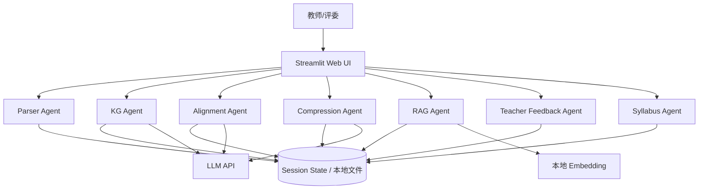
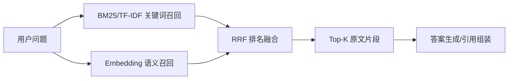

# EduMerge Agent 技术报告

## 1. 报告摘要

EduMerge Agent 是面向“学科知识整合智能体开发”场景的教学内容整合系统，目标是帮助教师将多本教材压缩为不超过原始体量 30% 的精华版课程材料，同时保留核心知识结构、引用依据和教学完整性。系统采用 Streamlit 单体 Web 应用承载交互体验，并在业务逻辑上拆分为 Parser、KG、Alignment、Compression、RAG、Teacher Feedback 与 Syllabus 等 Agent 化模块，以较低部署复杂度实现多源解析、知识图谱、跨教材对齐、精华压缩、检索问答、报告交付和教学大纲生成等能力。

本报告从需求目标、总体架构、核心模块、数据流程、算法策略、工程实现、部署运行、测试验证、风险控制和后续演进等维度，说明项目的技术方案与落地情况。

## 2. 项目目标与技术边界

### 2.1 业务目标

- **多教材整合**：支持教师上传多本教材或讲义，自动识别章节、页片段和知识点。
- **知识结构显性化**：以知识图谱形式展示教材中的核心概念、章节归属、关联关系和前置依赖。
- **跨教材去重与互补**：识别重复知识点、互补内容和覆盖不足内容，形成整合决策。
- **30% 精华版输出**：将原始教材内容压缩为约 30% 的精华版大纲和报告。
- **可追溯问答**：通过 RAG 检索提供带引用的原文问答，辅助教师核验。
- **教师反馈迭代**：接收教师自然语言反馈，动态调整整合计划和精华版输出。
- **教学大纲生成**：根据整合结果自动生成课程目标、章节安排、学时建议和考核建议。

### 2.2 技术边界

- MVP 阶段以本地应用和单机部署为主，不依赖复杂分布式调度。
- AI 调用以可配置 OpenAI-compatible API 为主，未配置 API Key 时保留本地启发式降级能力。
- Embedding 检索使用本地 sentence-transformers，兼顾中文语义召回、隐私保护与部署成本。
- 对教材版权内容仅在用户本地会话中处理，系统输出聚焦章节、知识点、整合方案和短引用。

## 3. 总体架构

### 3.1 架构分层

系统采用“前端交互层 + Agent 模块层 + AI 服务层 + 本地存储层”的结构。



### 3.2 技术选型

| 层级 | 技术/组件 | 选择理由 |
|---|---|---|
| Web UI | Streamlit | 快速构建可演示 Web 应用，适合黑客松迭代和数据可视化。 |
| 文档解析 | PyMuPDF、zip+xml、pandas/openpyxl/xlrd | 覆盖 PDF、Word、Excel、Markdown、TXT 等常见教学资料格式。 |
| 图算法 | NetworkX、PyVis | 便于构建知识点节点、章节归属和前置依赖关系，并生成交互式图谱。 |
| AI 接入 | OpenAI-compatible API | 兼容 ModelScope、DeepSeek 等模型服务，降低供应商耦合。 |
| 检索 | BM25/TF-IDF + sentence-transformers + RRF | 同时处理关键词精确匹配和中文语义匹配。 |
| 部署 | Docker、docker-compose | 固化运行环境，便于评审和迁移。 |

### 3.3 Agent 化职责拆分

| Agent/模块 | 输入 | 处理 | 输出 |
|---|---|---|---|
| Parser Agent | 上传文件 | 保存文件、抽取文本、清洗文本、识别章节 | 统一教材 JSON 结构 |
| KG Agent | 教材章节 | 抽取知识点、构造节点和边、补充关系 | 知识图谱 nodes/edges |
| Alignment Agent | 多本教材图谱/章节 | 计算跨教材重复、互补和缺失 | merge/keep/supplement/review 决策 |
| Compression Agent | 整合决策、教师反馈 | 生成精华版章节和压缩说明 | 30% 精华版大纲 |
| RAG Agent | 用户问题、教材片段 | 混合召回、RRF 融合、引用组装 | 带引用答案 |
| Teacher Feedback Agent | 教师自然语言反馈 | 追加反馈历史并重算方案 | 更新后的整合计划 |
| Syllabus Agent | 精华版/整合计划 | 生成目标、章节、学时和考核建议 | 教学大纲 |
| Report Writer | 教材、图谱、决策 | 汇总统计和重点案例 | Markdown 交付报告 |

## 4. 数据模型与状态管理

### 4.1 教材对象

教材解析后统一表示为字典结构，核心字段如下：

```json
{
  "textbook_id": "book_01",
  "filename": "example.pdf",
  "title": "example",
  "total_pages": 120,
  "total_chars": 180000,
  "chapters": [
    {
      "chapter_id": "ch_001",
      "title": "第一章 绪论",
      "start_page": 1,
      "end_page": 12,
      "text": "...",
      "char_count": 12000
    }
  ]
}
```

统一数据模型使后续知识图谱、对齐、压缩、RAG 和报告模块无需关心源文件格式。

### 4.2 会话状态

Streamlit Session State 承担 Agent 协调层职责，主要保存：

- `textbooks`：已解析教材列表。
- `parse_logs`：文件解析状态、格式、大小和错误信息。
- `integration_plan`：跨教材整合决策。
- `feedback`：教师多轮反馈历史。
- `essence_outline`：精华版输出。
- `syllabus`：教学大纲输出。
- `selected_llm_model`：运行期模型选择。

这种方式降低了系统复杂度，但生产化版本应迁移到数据库和任务队列，以支持并发、多用户和长任务恢复。

## 5. 核心模块设计

### 5.1 多格式解析模块

解析模块面向 PDF、Markdown/TXT、Word 和 Excel 提供统一入口。系统根据文件扩展名分发到对应解析器，并在解析过程中回传进度。

- PDF：使用 PyMuPDF 按页读取文本，保留页码和字符数。
- Markdown/TXT：按 UTF-8 文本读取并清洗，再按字符数切分为伪页。
- Word：直接读取 docx 内部 XML，抽取段落文本，避免额外重型依赖。
- Excel：逐工作表读取表格并转为文本片段。
- 章节识别：通过中文“第 X 章/节”和英文“Chapter X”正则识别章节边界；无法识别时回退为按页/片段组织。

### 5.2 知识图谱模块

知识图谱模块围绕“教材—章节—知识点—关系”构造可视化网络：

- 节点：教材、章节、知识点。
- 边：`contains` 表示包含关系，`related` 表示语义相关，`prerequisite` 表示前置依赖。
- 节点属性：来源教材、章节标题、出现频次、置信度、是否需要教师确认。
- 可视化：通过颜色区分教材来源，通过大小体现频次，并支持搜索和交互查看详情。

在 AI 可用时，模块可调用 LLM 进行知识点和关系抽取；AI 不可用时，通过章节标题、关键词和频次统计生成基础图谱，保证系统可演示。

### 5.3 跨教材对齐模块

跨教材对齐模块用于回答三个问题：

1. 哪些知识点在多本教材中重复出现，应合并？
2. 哪些知识点只在单本教材出现，但教学价值高，应保留？
3. 哪些知识链条存在缺口，需要教师补充或确认？

模块根据知识点名称、来源教材数量、章节位置、置信度和反馈意见生成决策：

| 决策 | 含义 | 处理策略 |
|---|---|---|
| `merge` | 多教材重复知识点 | 合并表述，保留代表性引用。 |
| `keep` | 关键但不重复内容 | 纳入精华版，标注来源。 |
| `supplement` | 覆盖不足或依赖缺失 | 加入教师确认队列。 |
| `review` | 置信度不足 | 在 UI 中提示人工复核。 |

### 5.4 30% 精华压缩模块

压缩模块以“保核心、去重复、补链条、控体量”为原则生成精华版：

- 优先保留跨教材重复且置信度高的核心知识点。
- 对单本教材特有但处于关键章节的内容进行筛选保留。
- 对重复表述执行合并，避免多本教材并列堆叠。
- 根据总字数估算整合后字数，目标压缩率控制在 30% 以内。
- 将教师反馈作为权重调整因素，例如“强化案例”“保留实验章节”“降低数学推导”等。

### 5.5 RAG 问答模块

RAG 模块面向教师核验与评委演示，提供带引用的问答能力。



设计要点：

- BM25/TF-IDF 提升术语、公式名和章节名的精确召回。
- Embedding 提升同义表达、跨章节概念和中文语义召回。
- RRF 将多路召回结果按排名融合，降低单一检索方法失误风险。
- 答案输出包含教材名、章节、页码/片段和引用摘要，便于教师追溯。

### 5.6 教师反馈模块

教师反馈模块不将系统结果视为一次性最终答案，而是支持多轮迭代。教师可以提出：

- 保留或删除某些章节。
- 强化实践案例或实验内容。
- 调整课程难度和学时分配。
- 对特定知识点标记为必讲、选讲或忽略。

系统记录反馈历史，并在重新生成整合计划、精华版和教学大纲时作为输入。

### 5.7 教学大纲模块

教学大纲模块根据整合计划和知识单元自动生成：

- 课程名称和课程目标。
- 章节列表和建议学时。
- 每章关键知识点、难度等级和教学建议。
- 总学时、知识点数量和压缩率统计。
- 考核建议与教学实施说明。

该模块是项目的创新扩展点，使系统从“内容压缩工具”升级为“课程重构助手”。

### 5.8 报告生成模块

报告生成模块汇总教材数量、总字数、估算压缩率、知识图谱统计、整合决策、教师反馈和精华版内容，输出 Markdown 格式的交付报告，便于纳入答辩材料或课程建设档案。

## 6. 关键算法与策略

### 6.1 章节识别策略

- 使用多语言正则识别标题：中文章/节、英文 Chapter。
- 对无法识别章节的文本按固定字符长度切分伪页。
- 保留页码/片段编号，供 RAG 引用和报告追溯使用。

### 6.2 混合检索与 RRF 融合

RRF 的核心思想是根据不同检索器中的排名进行加权，公式如下：

```text
score(d) = Σ 1 / (k + rank_i(d))
```

其中 `rank_i(d)` 是文档片段在第 i 个检索器中的排名，`k` 是平滑参数。这样即使不同检索器的原始分数不可比，也能通过排名稳定融合结果。

### 6.3 压缩率估算

系统使用原始总字数与整合后估算字数计算压缩率：

```text
compression_ratio = integrated_chars / original_chars
```

MVP 阶段默认以约 28% 作为报告侧估算目标，预留教师反馈和必要补充内容的空间，使最终结果更容易满足 30% 要求。

### 6.4 AI 降级策略

为避免演示时受网络、API Key 或模型服务波动影响，系统设计了降级路径：

- 未配置 AI 时仍可完成文件解析、章节识别、本地知识点抽取、基础整合和报告生成。
- Embedding 不可用时自动回退到关键词检索。
- LLM 调用结果通过本地缓存减少重复请求和成本。
- UI 中展示 AI 配置状态，避免用户误以为系统无响应。

## 7. 工程实现与目录结构

项目主要目录如下：

```text
.
├── app.py                    # Streamlit 主应用与多 Tab 交互
├── src/
│   ├── ai_analyzer.py        # LLM 调用、配置检测、缓存和模型选择
│   ├── aligner.py            # 跨教材对齐与整合决策
│   ├── api_usage.py          # API 调用统计与仪表板
│   ├── essence.py            # 30% 精华版生成
│   ├── kg_builder.py         # 知识图谱构建与可视化
│   ├── parser.py             # 多格式文档解析
│   ├── rag.py                # 文本切块、混合检索和问答
│   ├── report_writer.py      # Markdown 整合报告生成
│   ├── syllabus.py           # 教学大纲生成
│   └── utils.py              # 通用工具函数
├── docs/                     # 架构、需求、系统设计和技术报告
├── report/                   # 运行期生成报告
├── Dockerfile                # 容器镜像定义
├── docker-compose.yml        # 一键部署配置
└── requirements.txt          # Python 依赖清单
```

## 8. 部署与运行方案

### 8.1 本地运行

```bash
pip install -r requirements.txt
streamlit run app.py
```

访问 `http://localhost:8501` 后，可通过页面上传教材并按 Tab 顺序完成解析、图谱、整合、反馈、RAG、大纲和报告交付流程。

### 8.2 Docker 运行

```bash
docker-compose up -d
```

容器挂载 `data`、`logs`、`.cache` 和 `report` 目录，用于保留上传文件、日志、AI 缓存和生成报告。

### 8.3 环境变量

| 变量 | 含义 | 默认/示例 |
|---|---|---|
| `OPENAI_API_KEY` | LLM API Key | 用户自行配置 |
| `OPENAI_BASE_URL` | OpenAI-compatible 服务地址 | `https://api-inference.modelscope.cn/v1` |
| `LLM_MODEL` | 默认 LLM 模型 | `deepseek-ai/DeepSeek-V4-Pro` |
| `AI_PROVIDER` | 服务商展示名称 | `ModelScope` |

## 9. 测试与质量保障

### 9.1 静态与语法检查

建议在提交前执行：

```bash
python -m compileall app.py src
```

该命令可验证 Python 文件是否存在语法错误。

### 9.2 功能验证清单

| 场景 | 验证点 | 预期结果 |
|---|---|---|
| 上传 PDF | 页面展示解析进度和章节预览 | 成功识别页数、字数、章节。 |
| 上传 Word/Excel | 解析器能抽取文本 | 生成统一教材结构。 |
| 构建知识图谱 | 节点和边可视化 | 节点可点击、来源可区分。 |
| 跨教材整合 | 生成 merge/keep/supplement | 决策带置信度和原因。 |
| 教师反馈 | 提交反馈后重算 | 整合计划和精华版随反馈变化。 |
| RAG 问答 | 输入教材相关问题 | 返回答案与引用片段。 |
| 教学大纲 | 根据精华版生成 | 输出章节、学时和目标。 |
| 报告交付 | 生成 Markdown | `report/整合报告.md` 可下载或查看。 |

### 9.3 非功能验证

- **可用性**：解析和生成流程使用进度条与状态表反馈长任务状态。
- **鲁棒性**：单个文件解析失败不会中断整个批处理，错误写入解析日志。
- **可维护性**：业务逻辑集中在 `src/` 模块中，UI 只负责触发和展示。
- **可部署性**：提供 Dockerfile 和 docker-compose 配置。

## 10. 安全、隐私与成本控制

- 上传教材默认保存在本地 `data/uploads`，不会主动上传到第三方服务；仅 AI 分析调用时会向配置模型服务发送必要上下文。
- 本地 Embedding 降低全文外发需求，适合教育资料和内部讲义场景。
- AI 调用应控制上下文长度，并通过缓存避免重复成本。
- 报告与 RAG 答案应避免输出大段原文，主要提供短引用、章节定位和整合结论。
- Docker 部署时建议通过 `.env` 或平台密钥管理配置 API Key，不应硬编码在代码中。

## 11. 已知局限

- 章节识别依赖标题格式，扫描版 PDF 或复杂排版教材需要 OCR 和版面分析增强。
- 知识点抽取在本地启发式模式下准确率有限，复杂学科仍依赖 LLM 或人工复核。
- 当前 Session State 更适合单用户演示，多用户并发需要数据库、任务队列和用户隔离。
- Embedding 模型首次加载耗时较长，低配置机器可能影响首次问答体验。
- 30% 压缩率目前以估算和大纲控制为主，若要求严格按字数落地，需要增加精确字数预算器。

## 12. 后续演进路线

### 12.1 算法增强

- 引入 OCR 与版面分析，支持扫描教材、双栏 PDF 和公式图表解析。
- 建立知识点标准化词表，提升同义概念合并质量。
- 使用图嵌入或社区发现算法识别知识模块。
- 增加章节级覆盖率、依赖完整性和难度梯度评分。

### 12.2 工程增强

- 将长任务迁移到 Celery/RQ 等后台队列，避免 UI 阻塞。
- 使用 SQLite/PostgreSQL 保存教材、图谱、反馈和报告版本。
- 增加用户体系和课程空间，支持多课程、多教师协同。
- 增加自动化测试、CI、类型检查和端到端演示样例。

### 12.3 产品增强

- 支持整合前后对比视图，展示每个知识点的去留原因。
- 支持导出 Word/PDF/PPT 格式成果。
- 支持按教学周历生成授课计划和作业建议。
- 支持课堂问答和测验题生成，形成完整教学闭环。

## 13. 结论

EduMerge Agent 以模块化单体架构快速实现了多教材解析、知识图谱、跨教材整合、30% 精华压缩、RAG 问答、教师反馈和教学大纲生成等核心能力。该方案在黑客松场景下兼顾开发速度、演示完整性和后续扩展空间；在生产化方向上，可继续围绕解析准确率、知识对齐质量、多用户数据管理和自动化评估体系进行增强。
