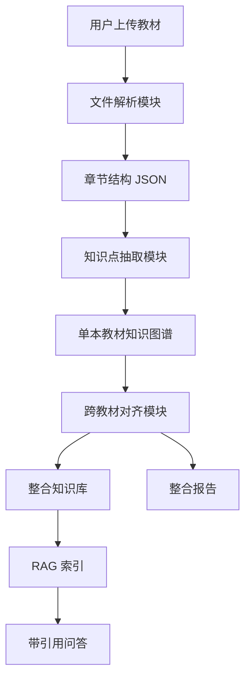

# 系统设计

## 1. 技术选型

| 层级 | 方案 |
|---|---|
| Web 框架 | Streamlit |
| PDF 解析 | PyMuPDF |
| 文本解析 | Python 原生读取 |
| 知识图谱 | NetworkX + pyvis |
| Embedding | sentence-transformers |
| 向量检索 | FAISS |
| LLM 调用 | OpenAI-compatible API |
| 数据存储 | JSON + session_state |
| 报告生成 | Markdown 模板 |

## 2. 数据流

## 3. 当前已实现模块

### 文件解析模块

输入：PDF / MD / TXT 文件

输出：统一教材结构 JSON。
